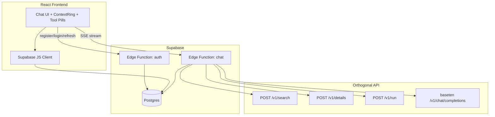
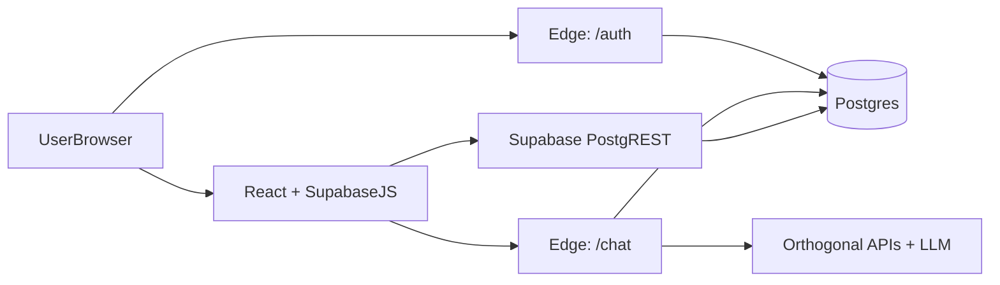

# Orthogonal AI Chat Interface

A web-based chat application where an AI assistant discovers and calls APIs through [Orthogonal](https://orthogonal.com) — returning real company data, contacts, web search results, and more.

## Approach

The app uses an **agent-with-tools** pattern:

1. User sends a message via the React frontend.
2. A Supabase Edge Function orchestrates an LLM (Baseten via Orthogonal) with three tools mirroring Orthogonal MCP:
   - `orthogonal_search` — find APIs by natural language
   - `orthogonal_get_details` — get endpoint parameters
   - `orthogonal_use` — execute API calls and return real data
3. Tool calls appear live in the UI as timeline pills; results are persisted to Postgres.
4. Context window usage is tracked and shown as a circular progress ring in the header.
5. `/compress` summarizes older messages; `/clear` wipes the conversation context.

**Why Baseten via Orthogonal?** One API key powers both the LLM and all marketplace APIs — no separate OpenAI key needed.

**Why custom email/password auth?** The app now uses app-owned users and JWT sessions (without Supabase Auth), so conversation access is scoped by app user identity and enforced by RLS.

## System Design



### Database Schema

- **`app_users`** — application identities (email-based accounts)
- **`app_user_credentials`** — password hash metadata per user
- **`app_sessions`** — refresh-session tracking with revocation and expiry
- **`conversations`** — thread metadata, ownership (`user_id`), title, context usage
- **`messages`** — chat timeline + tool metadata for replay
- **RLS** — all access checks use `current_app_user_id()` extracted from JWT claims, plus optional `is_public` read sharing

### Edge Function Responsibilities

- Authenticate via custom JWT (`APP_JWT_SECRET`)
- Handle `/clear` and `/compress` slash commands
- Run agent loop (max 8 tool iterations)
- Emit SSE events: `tool_start`, `tool_done`, `token`, `done`
- Persist messages and update token counts

## System Design

### Databases and State Stores

- **Primary database:** Supabase Postgres for OLTP data (`app_users`, `app_user_credentials`, `app_sessions`, `conversations`, `messages`)
- **Object storage:** Supabase Storage for chat attachments (folder partitioned by app user id)
- **Optional at scale:** Redis/Upstash for login rate-limit counters and short-lived auth/session cache

### Request and Auth Architecture



- User signs up/logs in via `auth` edge function.
- `auth` issues app JWT + refresh token; refresh token hash is persisted in `app_sessions`.
- Frontend sends access JWT as bearer token to PostgREST + edge functions.
- Postgres RLS resolves app identity using `current_app_user_id()` from JWT claims.
- `chat` edge function orchestrates tool calls and persists message history, so users can leave and return with full conversation state.

### Scaling Approach

- **Stateless edge compute:** `auth`, `chat`, `models`, and `integrations` can scale horizontally behind Supabase edge runtime.
- **DB scaling:** indexed chat access paths (`messages(conversation_id, created_at)`, ownership/session indexes), with read replicas for high read volume.
- **Message growth:** if needed, partition `messages` by time/tenant while preserving conversation-local query performance.
- **Auth throughput:** move rate-limit counters + session hot-path lookups to Redis when login/refresh traffic grows.
- **Async heavy work:** offload expensive analytics/summarization to background workers to keep chat latency low.

## Setup

### Prerequisites

- Node.js 18+
- [Supabase CLI](https://supabase.com/docs/guides/cli)
- Orthogonal API key ([dashboard](https://orthogonal.com/dashboard/settings/api-keys))
- Supabase project with custom auth secrets configured

> **Security:** Never commit API keys. Rotate any key that was shared in chat.

### 1. Supabase

```bash
# Link your project
supabase link --project-ref YOUR_PROJECT_REF

# Run migration
supabase db push

# Set secrets
supabase secrets set ORTHOGONAL_API_KEY=orth_live_your_key
supabase secrets set APP_JWT_SECRET=your_project_jwt_secret
supabase secrets set SUPABASE_SERVICE_ROLE_KEY=your_service_role_key

# Deploy edge functions
supabase functions deploy chat
supabase functions deploy auth
supabase functions deploy chat-worker --no-verify-jwt
supabase functions deploy chat-status --no-verify-jwt
supabase functions deploy conversations --no-verify-jwt

# Queue worker (async chat jobs)
supabase secrets set CHAT_QUEUE_MODE=on
supabase secrets set QUEUE_WORKER_SECRET="$(openssl rand -hex 32)"
supabase db push   # applies 006_queue_worker_cron.sql (pg_cron every minute)

# Store cron HTTP credentials in Vault (must match QUEUE_WORKER_SECRET)
npx supabase@latest db query --linked --yes "
  select vault.create_secret('https://YOUR_PROJECT_REF.supabase.co', 'project_url');
  select vault.create_secret('YOUR_QUEUE_WORKER_SECRET', 'queue_worker_secret');
"
```

### 2. Frontend

```bash
cd frontend
cp .env.example .env
# Fill in VITE_SUPABASE_URL and VITE_SUPABASE_ANON_KEY
npm install
npm run dev
```

### 3. Deploy Frontend (Vercel)

```bash
cd frontend
vercel
```

Set environment variables in Vercel:
- `VITE_SUPABASE_URL`
- `VITE_SUPABASE_ANON_KEY`

## Usage

| Command | Action |
|---|---|
| Natural language | Ask for company info, contacts, web results, etc. |
| `/clear` | Delete all messages and reset context |
| `/compress` | Summarize older messages (10+ messages recommended) |

### Example prompts

- "What APIs can you use to scrape a website?"
- "Enrich company data for stripe.com"
- "Find VPs of Sales at Stripe and get their verified emails"

## Scaling

- **Database:** Supabase connection pooler for high concurrency; indexes on `(conversation_id, created_at)`
- **Edge Functions:** Horizontally scaled by Supabase; stateless agent loop
- **Orthogonal:** Handles upstream API concurrency and billing per call
- **Rate limiting:** Add per-user limits on the edge function in production

## Concurrent Users

- RLS isolates each user's data at the Postgres level
- Shared Orthogonal API key with per-request billing
- Consider per-user credit budgets and request queuing at scale

## Failure Modes

| Error | Behavior |
|---|---|
| 402 Insufficient credits | Assistant explains; user adds balance at Orthogonal dashboard |
| 404 API not found | Tool result suggests re-searching the catalog |
| 428 Integration not connected | Returns OAuth link to connect Gmail/Slack/etc. |
| 5xx / timeout (30s) | Tool fails individually; chat continues with partial results |
| Rate limited | One retry with backoff, then surfaced to user |

## Testing

The repo includes a unified test suite at the root:

```bash
npm test                    # unit + integration + frontend build
npm run test:unit           # Deno tests for edge shared modules
npm run test:integration    # live Supabase + Orthogonal smoke tests
npm run test:build          # Vite production build
npm run test:e2e            # single live chat prompt (Stripe C-suite)
TEST_E2E=1 npm test         # full E2E chat suite (LLM + APIs, ~10 min)
TEST_E2E_APIS=1 npm test    # E2E every @slug capability + execute prompt (~30–90 min)
TEST_API_MATRIX=1 npm test  # get_details + /run smoke for all 55 catalog APIs
TEST_API_SLUG=perplexity npm run test:api-matrix   # single API integration
TEST_E2E_PHASE=capability TEST_E2E_APIS=1 node tests/e2e/chat-api-matrix.test.mjs --run
TEST_CATALOG=1 npm test     # get_details smoke for every catalog slug
```

**Requirements**

- Node.js 22+ (uses `--experimental-strip-types` for edge shared module tests)
- `frontend/.env` with `VITE_SUPABASE_URL` and `VITE_SUPABASE_ANON_KEY`
- `supabase/functions/.env` with `ORTHOGONAL_API_KEY` (integration tests)

**Layout**

```
tests/
├── lib/           # shared env loader, chat SSE client, Orthogonal client
├── unit/          # Deno + Node unit tests
├── integration/   # Supabase functions + Orthogonal API smoke
└── e2e/           # live chat SSE end-to-end prompts
```

## With More Time

- Tiktoken-accurate token counting
- Integration OAuth UI in-app
- Cost dashboard per conversation
- Batch tool pills (`batch_get_details`, `batch_use`)
- True LLM streaming on final response (not chunked replay)

## Project Structure

```
orthogonal/
├── frontend/          # Vite + React + Tailwind
├── supabase/
│   ├── migrations/    # Postgres schema + RLS
│   └── functions/     # chat edge function + shared modules
└── README.md
```

## License

MIT
